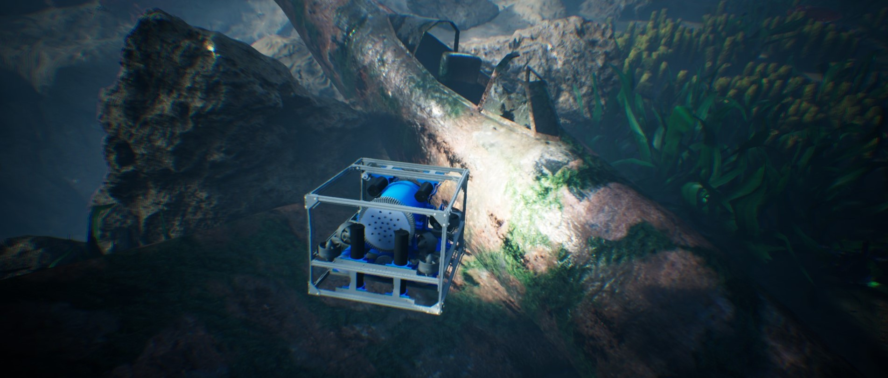

# HoloOcean Spawner Public Extract



HoloOcean Spawner is a public extract of a private research project built on **HoloOcean 2.2.2**.

The full project cannot be released publicly, so this repository isolates the parts that are directly relevant to:

- runtime asset spawning inside Unreal Engine;
- bulk underwater world population from JSON;
- sonar-aware world updates, including octree cache invalidation and rebuild after runtime geometry changes;
- the custom assets and environment content used for the sonar-oriented scene.

This repository is **not** a standalone replacement for the full HoloOcean source tree. It should be read as a compact, citable companion package that mirrors the original `engine/Source` and `engine/Content` paths closely enough to document the implementation and to be reintegrated into a private HoloOcean 2.2.2 checkout.

## What The Full Simulator Provides

The underlying simulator remains standard HoloOcean for everything outside the custom spawning pipeline. In practical terms, the full simulator provides:

- configurable worlds and scenarios driven from Python;
- multiple agent classes across underwater, surface, and aerial robotics workflows;
- a broad sensor stack, including DVL, IMU, depth, GPS, RGB cameras, ground-truth sensors, and multiple sonar types;
- weather, time-of-day, tide, fog, water-color, and ocean-current controls;
- a live Unreal Editor or Standalone Game workflow, plus headless or scripted operation through the Python client.

For the complete platform feature set, installation flow, and world/scenario system, use the official HoloOcean documentation listed near the end of this README.

## What This Public Repository Adds

Compared with standard HoloOcean, this extract documents and ships:

- a runtime spawner for `StaticMeshActor` instances in Unreal;
- three native world commands callable from Python:
  - `SpawnAsset`
  - `ClearSpawned`
  - `RespawnFromConfig`
- a dedicated Unreal actor, `RuntimeRowSpawner`;
- an explicit sonar update path that marks world geometry as dirty and rebuilds the sonar octree after runtime world changes;
- a bulk population script, [`main.py`](main.py), that reads a JSON spawn file and places underwater assets with category-specific logic;
- the custom/public subset of content used to build the sonar scene, including custom meshes, Megascans assets, map content, and configuration files.

In practice, this repository should be read as:

- a HoloOcean variant for building sonar-oriented custom worlds;
- a practical base for spawning your own assets or extra environment assets;
- a focused extension of HoloOcean, not a replacement for the original project and docs.

## Repository Layout

```text
.
|-- LICENSE
|-- README.md
|-- main.py
|-- client/
|   `-- docs/images/inspect_plane.jpg
`-- engine/
    |-- Content/
    |   |-- Config/
    |   |-- Megascans/
    |   |-- MSPresets/
    |   |-- WeatherContent/
    |   `-- ...
    `-- Source/
        `-- Holodeck/
            |-- ClientCommands/
            |-- General/
            |-- HolodeckCore/
            `-- Utils/
```

The repository currently contains:

- the public C++ files relevant to runtime spawning and sonar refresh;
- the environment map and selected Unreal assets used for the public scene extract;
- the public bulk population script and a root-level example population dataset (`world_population.json.example`);
- the original project `LICENSE`.

## Added Assets and Spawned Content

The clearest custom or explicitly used runtime assets in this repository are:

- `mine`: `/Game/mina.mina`
- `torpedo`: `/Game/siluro.siluro`
- `anchor`: `/Game/ancora.ancora`

Public-facing names in this extract use English labels such as `mine`, `torpedo`, and `anchor`.
The underlying Unreal package names remain `/Game/mina.mina`, `/Game/siluro.siluro`, and `/Game/ancora.ancora` because renaming `.uasset` packages safely would require Unreal-side asset renaming and redirector handling. Keeping the package names unchanged is the safest way to avoid broken binary references.
If you later want the actual Unreal asset packages renamed as well, do that inside Unreal Editor and fix redirectors there. Do not rename the `.uasset` files manually in the filesystem.

This variant also uses Megascans content to enrich sonar scenes:

- rock assets:
  - `/Game/Megascans/3D_Assets/Small_Beach_Rock_wd5mfgo/S_Small_Beach_Rock_wd5mfgo_lod3_Var1.S_Small_Beach_Rock_wd5mfgo_lod3_Var1`
  - `/Game/Megascans/3D_Assets/Coral_Stone_wfcnbfdr/S_Coral_Stone_wfcnbfdr_lod3_Var1.S_Coral_Stone_wfcnbfdr_lod3_Var1`
  - additional families available in `engine/Content/Megascans/3D_Assets/` include `Beach_Boulder_wfliedybw`, `Thai_Beach_Rocks_udxmahefa`, `Thai_Beach_Rocks_udzofaefa`, `Thai_Beach_Rocks_udzqaaffa`, and `Thai_Beach_Rocks_ueukcjega`
- coral assets:
  - `/Game/Megascans/3D_Assets/Thai_Beach_Coral_ufvhbayga/S_Thai_Beach_Coral_ufvhbayga_lod3_Var1.S_Thai_Beach_Coral_ufvhbayga_lod3_Var1`
  - additional coral packs are present in `Thai_Beach_Corals_Pack_uf3kbggfa` and `Thai_Beach_Corals_Pack_ufzkbcjfa`
- seaweed assets:
  - `/Game/Megascans/3D_Plants/Seaweed_sdpiF/S_Seaweed_sdpiF_Var1_lod1.S_Seaweed_sdpiF_Var1_lod1`
  - `/Game/Megascans/3D_Plants/Seaweed_sdpiF/S_Seaweed_sdpiF_Var3_lod1.S_Seaweed_sdpiF_Var3_lod1`
  - `/Game/Megascans/3D_Plants/Seaweed_sdpjN/S_Seaweed_sdpjN_Var4_lod1.S_Seaweed_sdpjN_Var4_lod1`
  - `/Game/Megascans/3D_Plants/Seaweed_sdpjN/S_Seaweed_sdpjN_Var7_lod1.S_Seaweed_sdpjN_Var7_lod1`
  - `/Game/Megascans/3D_Plants/Seaweed_sdpjN/S_Seaweed_sdpjN_Var10_lod1.S_Seaweed_sdpjN_Var10_lod1`
  - additional seaweed families are present in `Seaweed_sdokF`, `Ocean_Seaweed_sdDgS`, and `Ocean_Seaweed_sdDkn`

The public repository includes:

- [`world_population.json.example`](world_population.json.example)

The runtime population script first looks for a user-provided [`world_population.json`](world_population.json) next to [`main.py`](main.py) and falls back to the shipped example file if the user file is missing.

The internal development README for the private project referenced a larger research population dataset with `1533` runtime spawns:

- `240` mines
- `200` torpedoes
- `200` anchors
- `332` rocks
- `560` seaweed instances
- `1` coral probe

That exact large JSON file is **not present in this workspace snapshot**, so it is **not claimed as part of this public extract**. The public repository instead ships a smaller representative dataset that preserves the schema, asset categories, and spawning logic.

## Runtime Spawner Architecture

The core Unreal implementation lives in:

- [`engine/Source/Holodeck/Utils/Public/RuntimeRowSpawner.h`](engine/Source/Holodeck/Utils/Public/RuntimeRowSpawner.h)
- [`engine/Source/Holodeck/Utils/Private/RuntimeRowSpawner.cpp`](engine/Source/Holodeck/Utils/Private/RuntimeRowSpawner.cpp)

The runtime spawner works like this:

1. It finds a `ARuntimeRowSpawner` in the world or creates one automatically.
2. It loads a `UStaticMesh` from a `/Game/...` Unreal asset path.
3. If a JSON config is used, it parses `global` and `rows` sections.
4. For each row, it can:
   - find existing actors by name prefix, regex, folder, and tags;
   - choose a template actor;
   - derive positions from explicit `positions`, generated positions, or existing actor transforms;
   - derive rotations;
   - spawn missing actors;
   - copy collision, mobility, visibility, and tag settings from a template actor;
   - assign the new mesh, offsets, scale, and folder;
   - track spawned actors so they can be cleared later.

That means the spawner supports two practical workflows:

- pure runtime spawning, where it creates new actors;
- replace-and-align workflows, where it uses existing placeholders in the level as templates.

## World Commands

This variant adds three Unreal commands exposed to HoloOcean:

- [`engine/Source/Holodeck/ClientCommands/Public/SpawnAssetCommand.h`](engine/Source/Holodeck/ClientCommands/Public/SpawnAssetCommand.h)
- [`engine/Source/Holodeck/ClientCommands/Public/ClearSpawnedCommand.h`](engine/Source/Holodeck/ClientCommands/Public/ClearSpawnedCommand.h)
- [`engine/Source/Holodeck/ClientCommands/Public/RespawnFromConfigCommand.h`](engine/Source/Holodeck/ClientCommands/Public/RespawnFromConfigCommand.h)

### `SpawnAsset`

Arguments:

- `num_params = [x, y, z, roll, pitch, yaw, sx, sy, sz]`
- `string_params = [mesh_asset_path, optional_actor_label, optional_units]`

Supported units:

- `ue` or omitted: native Unreal units;
- `meters`, `meter`, `m`, or `client`: HoloOcean client meters.

Example:

```python
env.send_world_command(
    "SpawnAsset",
    num_params=[1200.0, -350.0, -800.0, 0.0, 0.0, 45.0, 1.0, 1.0, 1.0],
    string_params=["/Game/mina.mina", "mine_001", "meters"],
)
env.tick()
```

### `ClearSpawned`

Destroys only actors that were created at runtime through the spawner. It does not touch actors already saved in the level.

```python
env.send_world_command("ClearSpawned", num_params=[], string_params=[])
env.tick()
```

### `RespawnFromConfig`

Clears runtime-spawned actors and then applies a JSON configuration file.

```python
env.send_world_command(
    "RespawnFromConfig",
    num_params=[],
    string_params=["Content/Config/sonar_rows_runtime.json", "false"],
)
env.tick()
```

If no parameters are provided, the spawner uses its own `ConfigPath` setting.

## Runtime JSON Format

The reference row-based template is [`engine/Content/Config/sonar_rows_runtime.json.example`](engine/Content/Config/sonar_rows_runtime.json.example).

The public bulk population example is:

- [`world_population.json.example`](world_population.json.example)

The row-based structure used by `RuntimeRowSpawner` is:

```json
{
  "global": {
    "destroy_extra": false,
    "fail_if_mesh_missing": true,
    "use_client_units": false,
    "verbose_log": true
  },
  "rows": {
    "mine": {
      "enabled": true,
      "mesh_asset": "/Game/mina.mina",
      "name_prefix": "mine",
      "name_regex": "^(mine|mina)[0-9]*$",
      "folder": "Assets_Sonar/mine",
      "target_count": 4,
      "positions": [],
      "rotations": []
    }
  }
}
```

Important fields:

- `global.destroy_extra`: removes actors beyond the target count;
- `global.use_client_units`: interprets coordinates in HoloOcean client meters instead of Unreal centimeters;
- `rows.<name>.mesh_asset`: Unreal mesh path to spawn;
- `rows.<name>.target_count`: desired number of actors;
- `rows.<name>.positions`: explicit list of positions;
- `rows.<name>.rotations`: explicit list of `roll, pitch, yaw` rotations;
- `rows.<name>.position_generation`: generates positions from `start`, `step`, and `count`;
- `rows.<name>.offset_space`: `world` or `local`;
- `rows.<name>.offset_location` and `offset_rotation`: final transform corrections;
- `rows.<name>.fit_scale_to_reference_actor`: scales the new asset to match the template actor;
- `rows.<name>.keep_existing_actor_scale_ratio`: controls whether existing actor scale ratios are preserved;
- `rows.<name>.folder`: World Outliner folder;
- `rows.<name>.name_prefix` and `name_regex`: matching rules for existing actors;
- `rows.<name>.destroy_extra`: per-row override of the global behavior.

The bulk population example used by [`main.py`](main.py) has a separate schema:

- top-level `metadata`
- top-level `spawns`
- per-entry fields such as `category`, `label`, `mesh_asset`, `location`, `rotation`, `scale`, and `units`

## Bulk World Population With `main.py`

[`main.py`](main.py) is the entry point for automatically populating the world from:

- [`world_population.json`](world_population.json) placed next to `main.py`
- or, if missing, [`world_population.json.example`](world_population.json.example)

The full research `world_population.json` is intentionally not shipped in this public extract. The expected workflow is to add your own root-level `world_population.json` locally when you want to run the larger population pass.

The script:

1. reads `metadata` and `spawns` from the JSON file;
2. opens a live HoloOcean session with `start_world=False`;
3. queues `SpawnAsset` commands in batches;
4. applies category-specific placement rules;
5. calls `tick(publish=False)` between batches to keep runtime spawning stable.

The custom logic in `main.py` includes:

- batching, currently `120` spawns per batch;
- a global Z offset;
- category-based scale multipliers;
- absolute Z overrides and Z caps for specific categories;
- deterministic rotation jitter;
- XY overlap resolution against recently placed objects;
- support for categories such as `seaweed`, `giant_seaweed`, `rocks`, `coral`, `mine`, `torpedo`, and `anchor`.
- backward-compatible alias handling for older internal category names such as `mina`, `siluro`, and `ancora`.

Current defaults in the script include:

- `seaweed` and `giant_seaweed` forced to absolute Z `-7150`;
- `coral` forced to absolute Z `-7150`;
- `mine` raised by `1100` Unreal units and capped at `-3600`;
- `anchor` capped at `-3900`;
- `rocks` offset by `-120`;
- category-based scale multipliers such as `x11` for seaweed and `x10` for rocks and coral.

To run the bulk spawn workflow after reintegrating this extract into a working HoloOcean 2.2.2 environment:

1. launch `ExampleLevel` in `Standalone Game` or from your private Unreal project;
2. make sure the `holoocean` Python client is installed and importable;
3. run:

```bash
python main.py
```

## Spawning Your Own Assets

To spawn your own asset you need:

1. a valid `Static Mesh` inside the Unreal project;
2. a correct Unreal asset path in `/Game/...` format;
3. the asset to be available during cooking and packaging.

Spawn a torpedo:

```python
env.send_world_command(
    "SpawnAsset",
    num_params=[8.0, -3.0, -42.0, 0.0, 0.0, 15.0, 0.8, 0.8, 0.8],
    string_params=["/Game/siluro.siluro", "torpedo_runtime_01", "meters"],
)
env.tick()
```

Spawn a Megascans rock:

```python
env.send_world_command(
    "SpawnAsset",
    num_params=[4.0, 6.0, -71.5, 0.0, 0.0, 120.0, 10.0, 10.0, 10.0],
    string_params=[
        "/Game/Megascans/3D_Assets/Coral_Stone_wfcnbfdr/"
        "S_Coral_Stone_wfcnbfdr_lod3_Var1.S_Coral_Stone_wfcnbfdr_lod3_Var1",
        "rock_runtime_01",
        "meters",
    ],
)
env.tick()
```

Spawn seaweed:

```python
env.send_world_command(
    "SpawnAsset",
    num_params=[12.0, 4.0, -71.5, 0.0, 0.0, 35.0, 11.0, 11.0, 11.0],
    string_params=[
        "/Game/Megascans/3D_Plants/Seaweed_sdpiF/"
        "S_Seaweed_sdpiF_Var1_lod1.S_Seaweed_sdpiF_Var1_lod1",
        "seaweed_runtime_01",
        "meters",
    ],
)
env.tick()
```

If a cooked build fails to load a dynamically referenced asset, make sure it is referenced by the project or add it to the `AlwaysCookMeshes` list in `RuntimeRowSpawner`.

## Why This Variant Matters For Sonar

The key addition is not just spawning. The sonar must also see the updated geometry.

In this repository, every geometry change performed by the runtime spawner calls:

- `Octree::MarkWorldGeometryDirty()`

This happens when:

- a single asset is spawned;
- runtime-spawned assets are cleared;
- a JSON config is applied or reapplied.

Then, in [`engine/Source/Holodeck/HolodeckCore/Private/HolodeckSonar.cpp`](engine/Source/Holodeck/HolodeckCore/Private/HolodeckSonar.cpp), the sonar:

1. checks `Octree::ConsumeWorldGeometryDirty()`;
2. clears the octree cache for the current world when needed;
3. resets its internal octree state;
4. rebuilds the octree.

That is the practical difference this repository adds for sonar-heavy workflows: runtime-spawned geometry is not left invisible to the sonar pipeline.

## Using This Extract In Practice

This repository is designed to be merged into or read alongside a private/local HoloOcean 2.2.2 checkout.

For actual use you still need:

- Unreal Engine `5.3`;
- Visual Studio `2022` or `2019`;
- `git`;
- a Python environment;
- the HoloOcean Python client (`holoocean`);
- a working HoloOcean Unreal project that can be built and launched.

Recommended integration flow:

1. start from a private/local copy of **HoloOcean 2.2.2**;
2. copy the public extract into the corresponding project paths;
3. rebuild the Unreal project;
4. add a `RuntimeRowSpawner` actor to the target level if desired;
5. configure `Config Path = Content/Config/sonar_rows_runtime.json`;
6. use the provided templates to create local runtime or population JSON files;
7. run your Python workflow against the already running Unreal instance.

The spawner can auto-create itself when commands are sent from Python, but placing the actor in the level is the better choice when you want a fixed `ConfigPath` and a repeatable iteration loop.

## Key Files

- [`LICENSE`](LICENSE)
- [`README.md`](README.md)
- [`main.py`](main.py)
- [`client/docs/images/inspect_plane.jpg`](client/docs/images/inspect_plane.jpg)
- [`engine/Content/Config/config.json`](engine/Content/Config/config.json)
- [`engine/Content/Config/materials.csv`](engine/Content/Config/materials.csv)
- [`engine/Content/Config/runtime_world_commands_README.md`](engine/Content/Config/runtime_world_commands_README.md)
- [`engine/Content/Config/sonar_rows_runtime.json.example`](engine/Content/Config/sonar_rows_runtime.json.example)
- [`world_population.json`](world_population.json) if you add your full dataset locally
- [`world_population.json.example`](world_population.json.example)
- [`engine/Source/Holodeck/Utils/Public/RuntimeRowSpawner.h`](engine/Source/Holodeck/Utils/Public/RuntimeRowSpawner.h)
- [`engine/Source/Holodeck/Utils/Private/RuntimeRowSpawner.cpp`](engine/Source/Holodeck/Utils/Private/RuntimeRowSpawner.cpp)
- [`engine/Source/Holodeck/ClientCommands/Private/SpawnAssetCommand.cpp`](engine/Source/Holodeck/ClientCommands/Private/SpawnAssetCommand.cpp)
- [`engine/Source/Holodeck/ClientCommands/Private/ClearSpawnedCommand.cpp`](engine/Source/Holodeck/ClientCommands/Private/ClearSpawnedCommand.cpp)
- [`engine/Source/Holodeck/ClientCommands/Private/RespawnFromConfigCommand.cpp`](engine/Source/Holodeck/ClientCommands/Private/RespawnFromConfigCommand.cpp)
- [`engine/Source/Holodeck/HolodeckCore/Private/HolodeckSonar.cpp`](engine/Source/Holodeck/HolodeckCore/Private/HolodeckSonar.cpp)
- [`engine/Source/Holodeck/General/Private/Octree.cpp`](engine/Source/Holodeck/General/Private/Octree.cpp)

## Official HoloOcean Documentation

For everything outside the runtime spawner and sonar-specific additions in this repository, use the official HoloOcean documentation:

- docs home: <https://byu-holoocean.github.io/holoocean-docs>
- installation: <https://byu-holoocean.github.io/holoocean-docs/develop/usage/installation.html>
- quickstart: <https://byu-holoocean.github.io/holoocean-docs/develop/usage/getting-started.html>
- Unreal development: <https://byu-holoocean.github.io/holoocean-docs/develop/start.html>
- agents: <https://byu-holoocean.github.io/holoocean-docs/develop/agents/agents.html>
- sensors: <https://byu-holoocean.github.io/holoocean-docs/develop/holoocean/sensors.html>
- packages and worlds: <https://byu-holoocean.github.io/holoocean-docs/develop/packages/packages.html>
- scenarios and configuration: <https://byu-holoocean.github.io/holoocean-docs/develop/usage/scenarios.html>

## Summary

Use this repository when you want to:

- build sonar-oriented custom worlds on top of HoloOcean;
- spawn your own assets or Megascans assets directly from Python;
- repopulate the seabed with mines, torpedoes, anchors, rocks, coral, and seaweed;
- study or cite the runtime-spawn and sonar-refresh implementation without publishing the whole private project;
- keep a public companion repository aligned with **HoloOcean 2.2.2**.

Operational note:

- no individual file in this repository exceeds GitHub's 100 MB per-file limit;
- the repository payload is still large because Unreal assets are binary and numerous, so Git LFS or GitHub Releases may still be preferable for long-term distribution.
